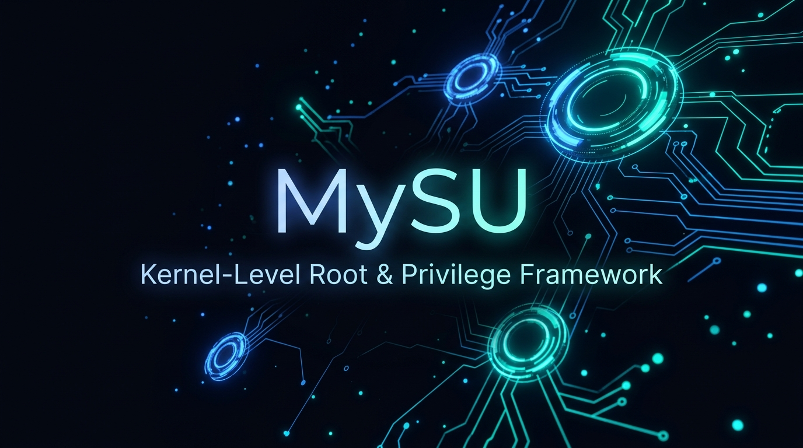

<div align="center">
  
  <br /><br />
  <h1>MySU</h1>
  <p><strong>Kernel-level root framework & systemless modular environment tailored for custom Android kernels</strong></p>
</div>

---

## What is this?
**MySU** is a high-performance kernel-assisted root solution and systemless modification framework. Engineered for custom kernels (including 4.19.x and GKI 2.0+ on `arm64` and `x86_64`), MySU provides fine-grained root access control, dynamic SELinux policy live-patching, and an isolated userspace environment without relying on filesystem symlinks.

## Features
- **Kernel-Level Elevation**: Direct syscall and LSM hook infrastructure paired with anonymous inode ioctl communication (`[mysu_driver]`).
- **Clean Userspace (`mysud`)**: Native `/data/adb/mysu/` layout with pure programmatic module adaptation and pure environment variables (`MYSU=true`).
- **TheVoid Adaptive Material 3 Manager**: Android management app with deep obsidian dark themes, Void violet accents, and granular app profiles.
- **Automated Module Porting**: Dedicated migration tools (`scripts/mysu-module-port.sh` / `scripts/mysu_port.py`) to convert Magisk/MySU packages to native MySU modules.
- **SELinux Live-Patching**: In-kernel rules modification preserving enforcing mode integrity.

## Installation

### Kernel Integration
Add MySU into your kernel source tree:
```bash
# In your kernel root directory:
curl -LSs "https://raw.githubusercontent.com/kelexine/mysu/main/kernel/setup.sh" | bash -
```

### Userspace Daemon (`mysud`)
Build the daemon via `just`:
```bash
just build_mysud
```

### Manager App
Build the Android manager APK:
```bash
just build_manager
```

## Usage

### CLI Daemon Commands
```bash
# Superuser shell
mysud su

# List active modules
mysud module list

# Install a module with automated script adaptation
mysud module install /path/to/module.zip

# Check SELinux policy rule syntax
mysud sepolicy check "allow su * * *"
```

### Porting Existing Modules
```bash
# Convert a legacy module zip into a native MySU package
./scripts/mysu-module-port.sh legacy_module.zip output_mysu.zip
```

## Architecture
```
Kernel Space:   [MySU Driver / Supercall] <---> [SELinux / LSM / Syscall Hooks]
                               ▲
                               │ ioctl ([mysu_driver])
                               ▼
Userspace:      [mysud Daemon] (/data/adb/mysu/) <---> [Init / Metamodules]
                               ▲
                               │ IPC / CLI
                               ▼
Management:     [MySU Manager App] (dev.kelexine.mysu)
```

## Contributing
- **Branch Naming**: `<type>/<short-slug>` (e.g. `feat/thevoid-theme`, `fix/hook-arm64`)
- **Commits**: Follow Conventional Commits format with sign-off.
- Features branch off `dev`, hotfixes off `main`.

## Acknowledgments & Credits

> [!NOTE]
> **MySU** is a personal, heavily refactored, and rebranded fork of the upstream **[KernelSU](https://github.com/tiann/KernelSU)** project, maintained primarily for personal use on custom kernels (`TheVoid-Kernel`, 4.19.x, 5.10+, 6.x).
>
> All core architectural concepts, kernel hooking foundations, and superuser paradigms originate from the pioneering work of the **KernelSU Team**. Huge thanks and full credit to:
> - **[weishu (tiann)](https://github.com/tiann)** and the **[KernelSU Contributors](https://github.com/tiann/KernelSU/graphs/contributors)** for creating KernelSU.
> - **[Kernel-Assisted Superuser (zx2c4)](https://git.zx2c4.com/kernel-assisted-superuser/about/)** for the initial kernel-assisted root concept.
> - **[topjohnwu (Magisk)](https://github.com/topjohnwu/Magisk)** for pioneering modern systemless Android root.
> - **[brevent / genuine](https://github.com/brevent/genuine)** for APK signature verification techniques.

## License
- `kernel/` directory: [GPL-2.0-only](https://www.gnu.org/licenses/old-licenses/gpl-2.0.en.html)
- Userspace (`mysud`/`mysuinit`) and Manager: [GPL-3.0-or-later](https://www.gnu.org/licenses/gpl-3.0.html)
